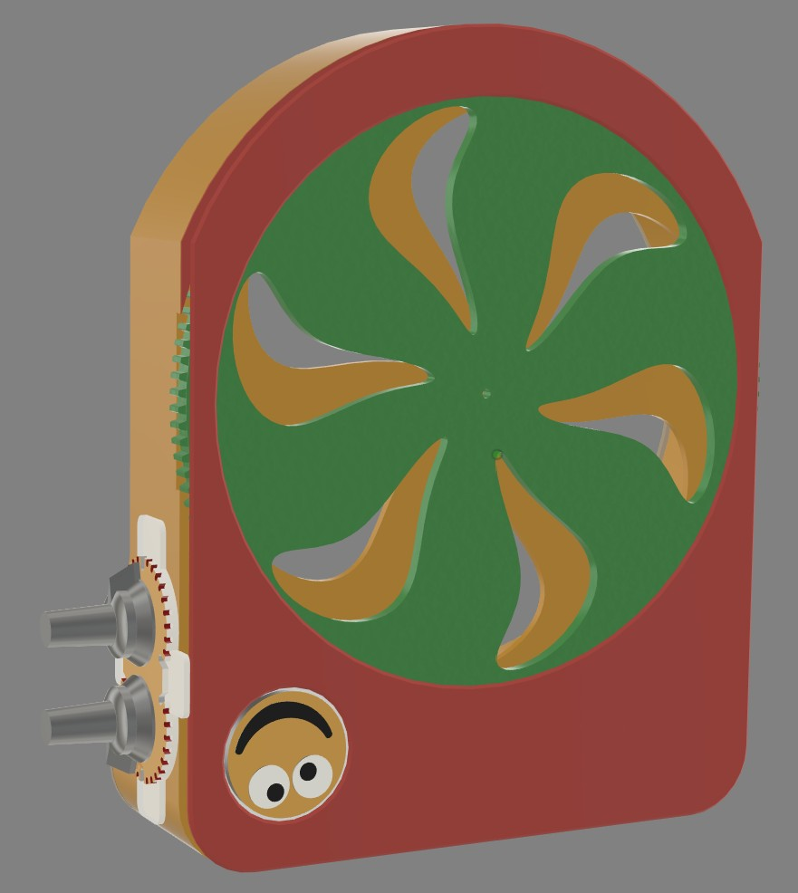
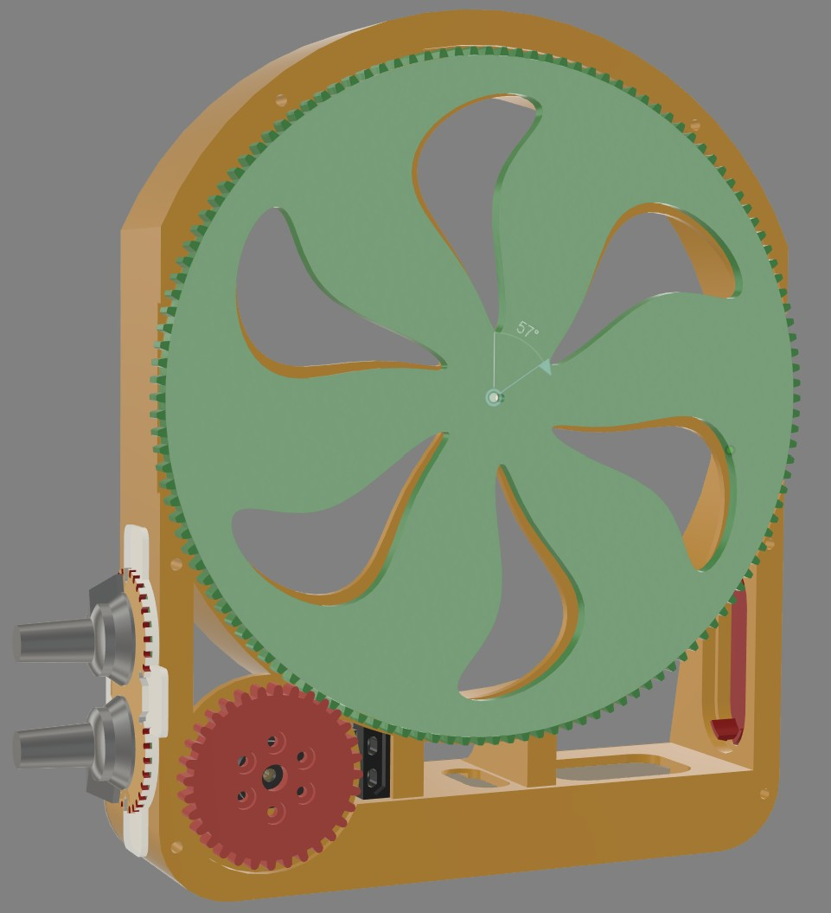
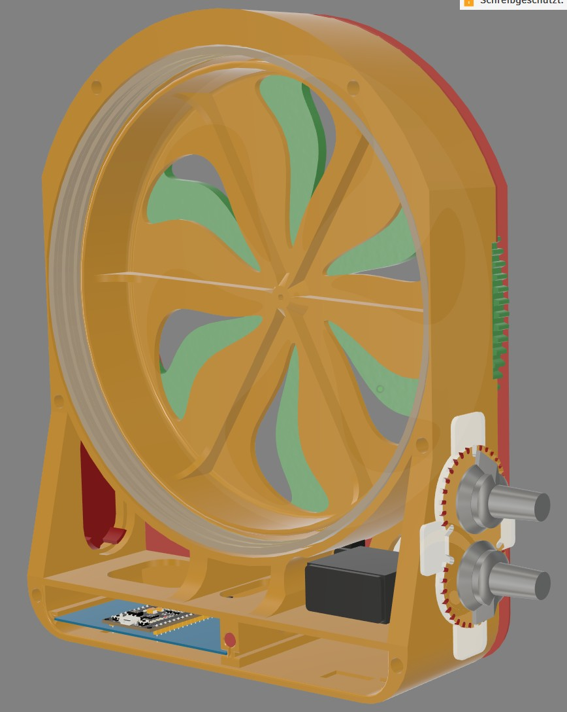
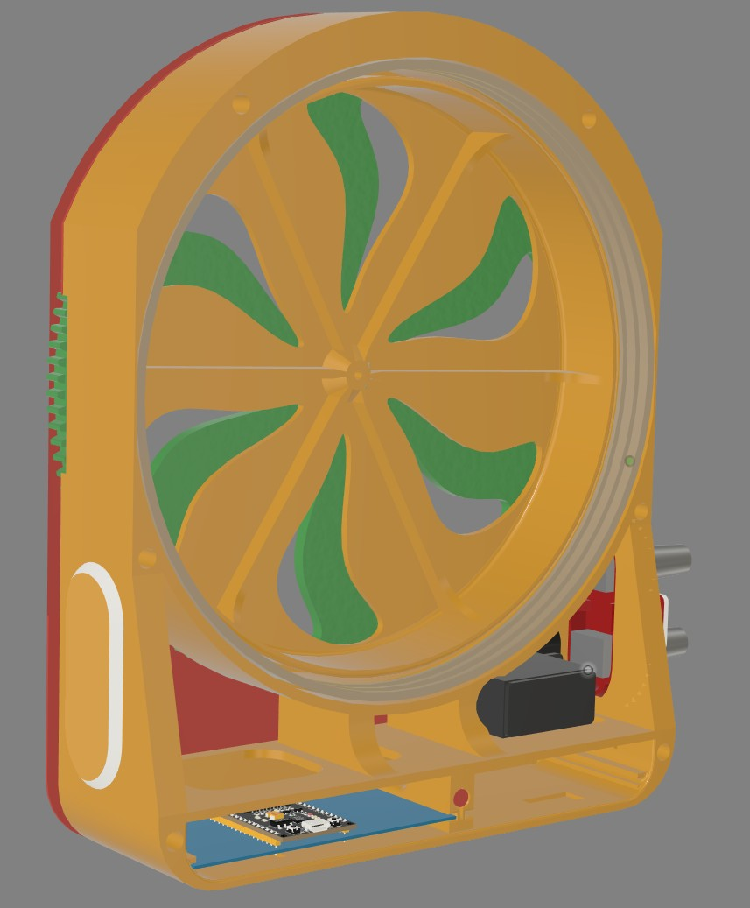
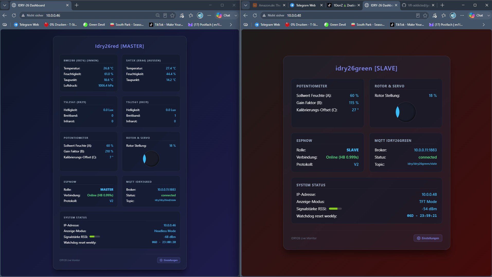
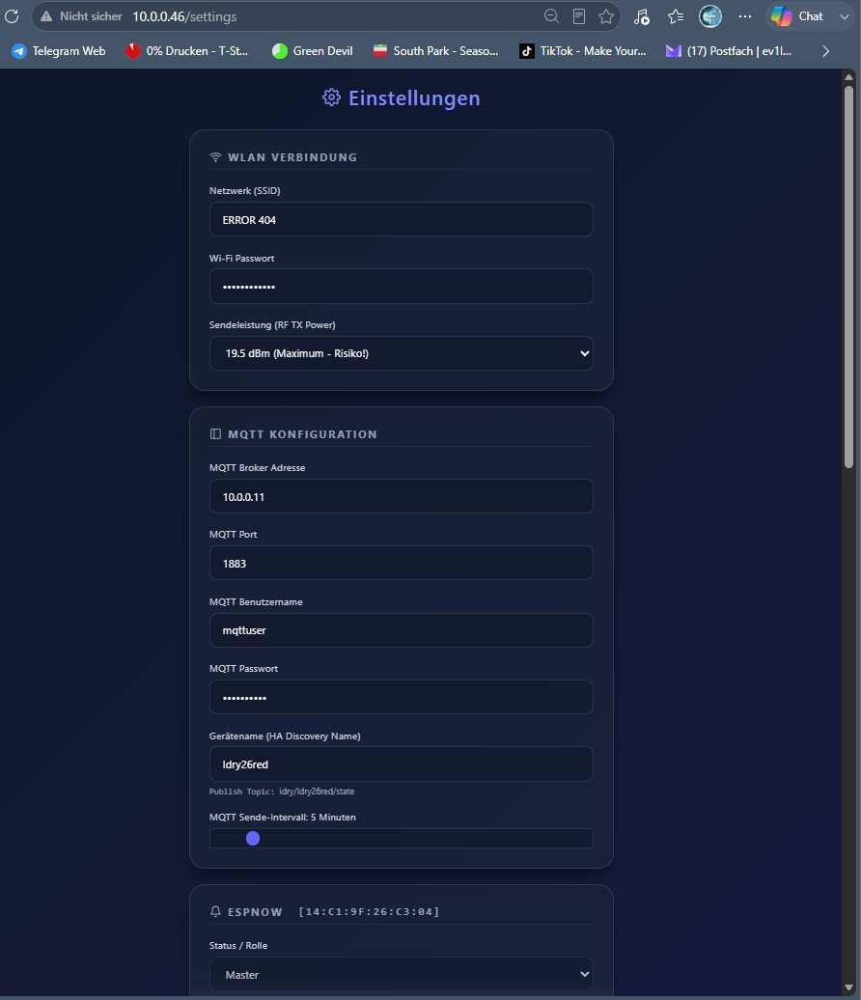
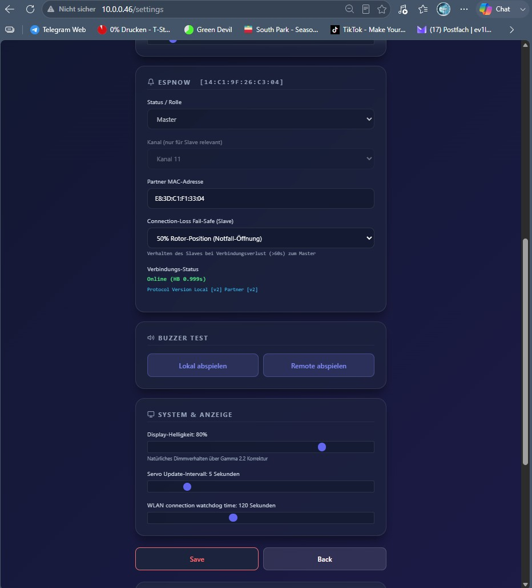
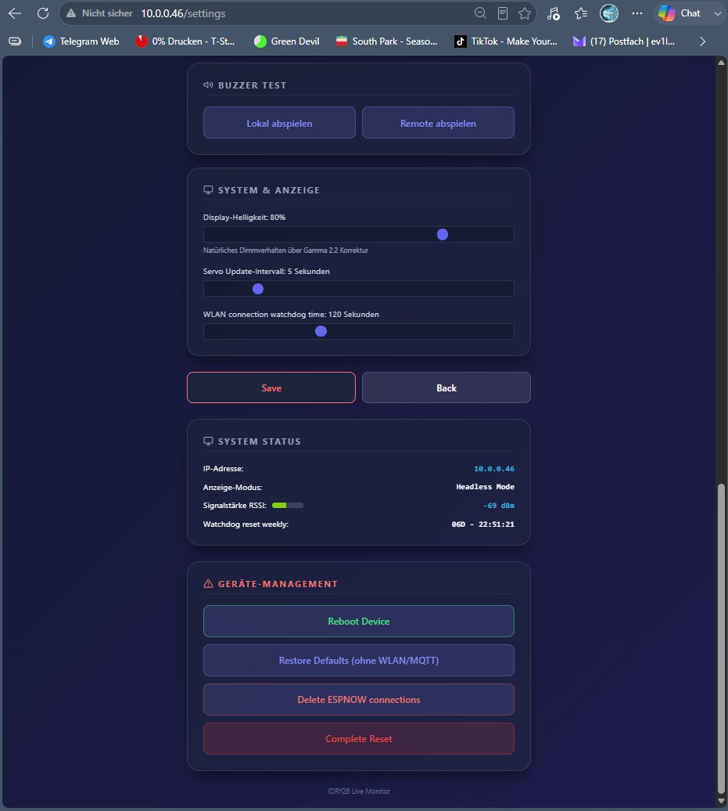

# 🌿 iDry-26: Smart Climate & Servo Shutter Controller (ESP32-S3)

<p align="center">
  
  
  
  
  
</p>

**iDry-26** ist eine hochentwickelte, ausfallsichere IoT-Klima- und Lüftungsklappensteuerung auf Basis des **YD-ESP32-S3**. Das System regelt Lüftungsrohre über Servo-Blendenverschlüsse vollautomatisch, schützt Erntegut oder Pflanzen vor Feuchtigkeitsinjektion (Thermodynamischer Feuchteschutz), kommuniziert verschlüsselt über **ESP-NOW Master/Slave-Kopplung**, bietet nahtlose **Home Assistant Integration** und unterstützt flexible Hardware-Ausbaustufen von *Headless* bis *Vollausbau*.

---

## 📷 Galerie & UI-Vorschau

<div align="center">

### ⚙️ Hardware & Mechanischer Aufbau

| Frontansicht mit Blende | Mechanik & Servosteuerscheibe |
| :---: | :---: |
|  |  |

| Rückseite & Verkabelung | Gehäuse & Seitenansicht |
| :---: | :---: |
|  |  |

<br>

### 🖥️ Web-Interface & Monitoring Dashboard

| Dual Live Monitor (Master & Slave synchronisiert) | Einstellungen: WLAN, MQTT & ESP-NOW Pairing |
| :---: | :---: |
|  |  |

| Einstellungen: Watchdogs & Signalstärke-Balken | Einstellungen: Fail-Safe Schutz & Geräte-Management |
| :---: | :---: |
|  |  |

</div>

---

## 🏗️ Hardware-Ausbaustufen (Skalierbarkeit)

Das System erkennt alle Komponenten beim Systemstart vollautomatisch und passt sein Verhalten dynamisch an:

1. **Stufe 1: Minimalist (Headless Mode)**
   * Nur das YD-ESP32-S3 Board ohne angeschlossenes Display oder Sensoren.
   * **Vorteil:** Minimale Leistungsaufnahme, ideal als reiner Netzwerk-Aktor oder ESP-NOW Empfänger. Volle Steuerung über das Web-UI und MQTT.
2. **Stufe 2: Standard Single-Display**
   * Automatische Erkennung am gemeinsamen JST-Kabelbaum:
     * **Waveshare 3.52" e-Paper (B)** (360x240, Rot/Schwarz/Weiß, extrem stromsparend).
     * **ILI9341 3.2" TFT-Touchdisplay** (320x240, hohe Bildwiederholrate).
3. **Stufe 3: Vollausbau (Sensorik & Analogregler)**
   * **Dual I2C Feuchtesensoren:** BME280 (Innen/Barometer) + SHT31 (Außen).
   * **Dual I2C Helligkeitssensoren:** TSL2561 (Breitband + Infrarot).
   * **3x Analog-Potentiometer:** Poti A (Sollwert Feuchte 48-72%), Poti B (Gain 0-400%), Poti C (Servo-Nullpunkt Offset 0-59°).
   * **Aktorik & Akustik:** PWM-Servo (LEDC Sinus-Ramping) + Passiver Buzzer für Arpeggio-Melodien und Alarme.
4. **Stufe 4: Verschlüsseltes ESP-NOW Master/Slave Mesh**
   * Drahtlose Synchronisation zweier Einheiten über CCMP LMK 128-Bit Hardware-Verschlüsselung.
   * Der Master spiegelt seine Klappenstellung in Echtzeit auf den Slave.
   * **Notfall-Fail-Safe Schutz:** Bricht die Funkverbindung >60s ab, fährt der Slave automatisch auf 50% Sicherheitsöffnung oder übernimmt autonom über lokale Sensoren.
5. **Stufe 5: Home Assistant Integration**
   * Automatische MQTT Auto-Discovery aller Sensorwerte, Servostellungen, Empfangsfeldstärken und Watchdog-Countdowns.

---

## 🔌 Hardware-Verkabelung (Pinout)

Die Displays teilen sich denselben physischen SPI-Kabelbaum (JST-Stecker am YD-ESP32-S3):

| Display-Pin (E-Ink / TFT) | Kabelfarbe | YD-ESP32-S3 Pin | Funktion |
| :--- | :--- | :--- | :--- |
| **VCC** | Rot | `3.3V` | Stromversorgung |
| **GND** | Schwarz | `GND` | Masse |
| **DIN / MOSI** | Blau | `GPIO 11` | SPI-Datenleitung (MOSI) |
| **CLK / SCK** | Gelb | `GPIO 12` | SPI-Taktleitung (SCK) |
| **CS** | Orange | `GPIO 10` | Chip Select |
| **DC / RS** | Grün | `GPIO 9` | Data / Command Control |
| **RST** | Weiß | `GPIO 14` | Panel Reset |
| **BUSY / LED** | Grau | `GPIO 8` | E-Ink: Busy-Line / TFT: Backlight-PWM |

### Sensorik, Potentiometer, Buzzer & Servo Pinout
* **I2C Bus:** `SDA` -> `GPIO 15` | `SCL` -> `GPIO 16`
* **Passiver Buzzer:** `GPIO 17` (NPN-Transistor Ansteuerung)
* **Servo Motor (PWM):** `GPIO 18` (LEDC Kanal 2)
* **Poti A (Sollwert Feuchte):** `GPIO 4` (ADC)
* **Poti B (Regel-Gain):** `GPIO 5` (ADC, heavily EMA low-pass filtered)
* **Poti C (Servo-Nullpunkt Offset):** `GPIO 1` (ADC)

---

## 🚀 Key Features & Algorithmen

### 1. Hardware 3-State Display-Auto-Detector
* **TFT Mode:** Liest `GPIO 8` beim Start als `INPUT_PULLUP`. Die Transistor-Last der Backlight-Beleuchtung zieht den Pin auf `LOW` -> TFT erkannt.
* **e-Paper Mode:** Pin verbleibt auf `HIGH`. Nach einem Reset-Puls über `GPIO 14` ändert sich der Status an `GPIO 8` (Busy-Signal) -> e-Paper erkannt.
* **Headless Mode:** Wenn sich kein Signal ändert, wird das Zeichnen im Code vollständig übersprungen, um Strom zu sparen und die Loop-Performance zu maximieren.

### 2. Entstörte Analogerfassung (EMA Low-Pass Filter)
* Analogwerte werden mit einem **Exponential Moving Average (EMA)** Tiefpass-Filter geglättet.
* Poti B (Gain-Faktor 0-400%) nutzt ein starkes $\alpha = 0,05$ Filter, um ADC-Rauschen komplett abzufangen und ein nervöses Springen in der Benutzeroberfläche zu verhindern.
* In der Web-UI und MQTT wird Poti B als saubere Ganzzahl (`204 %` statt `204.4 %`) dargestellt.

### 3. Closed-Loop Servo Ramping & Powerdown
* **Sinus-Ramping (Sine Easing):** Klappenbewegungen erfolgen stufenlos über eine Sinuskurve (`0.5f * (1.0f - cos(t * PI))`) für vibrationsfreies Anfahren.
* **Stromsparmodus & Summschutz:** Nach 1 Sekunde Stillstand an der Zielposition schaltet der ESP32 das PWM-Signal des Servos ab (`ledcWrite(18, 0)`). Das verhindert kontinuierliches Mikrozucken und Brummen des Servos im Leerlauf.
* **Prozentuale Randbereiche:** 
  * $\le 49\%$: Rigoros ZU (0% Klappenöffnung).
  * $\ge 71\%$: Rigoros AUF (100% Klappenöffnung).

### 4. Thermodynamischer Feuchteschutz (Saug-Sperre) & Drossel
* **Saug-Sperre:** Ist die Außenluft feuchter als die Innenluft oder liegt sie $>2\%$ über dem Sollwert, schließt die Klappe sofort auf **0%**, um das Einsaugen feuchter Luft zu verhindern (inkl. akustischem Warn-Chime).
* **Austrocknungsbegrenzer:** Bei extrem trockener Außenluft (Differenz $>10\%$) wird die maximale Öffnung automatisch gedrosselt, um Pflanzenschocks zu vermeiden.

### 5. ESP-NOW Master/Slave Reconnection & 2-Stufen Fail-Safe
* **Fast-Track Pairing:** Automatisches Channel-Hopping (Kanal 1–13) und Pairing per 128-Bit CCMP LMK Verschlüsselung.
* **Aggressiver Stack-Reset (>20s):** Verliert der Slave für mehr als 20 Sekunden den Kontakt zum Master, wird der ESP-NOW Stack im Hintergrund alle 15s re-initialisiert, ohne den Mikrocontroller neu zu starten (Servo bleibt ungestört).
* **Fail-Safe Schutz (>60s):**
  * **Typ 0 (Standard):** Der Slave schaltet automatisch auf **50% Notfall-Öffnung**, damit der Luftstrom im Zelt niemals abbricht.
  * **Typ 1 (Autonom):** Bei angeschlossenem lokalen Sensor übernimmt der Slave wieder eigenständig die Steuerung.
  * Wird kein Sensor erkannt, erzwingt das Web-UI automatisch Typ 0 und blendet eine 3-zeilige Hilfestellung ein.

### 6. Aktive Netzwerk-Watchdogs & Wöchentlicher Reboot
* **Gateway Wächter:** Prüft alle 2s per TCP-Handshake (Timeout 400ms) die Verbindung zum Router-Gateway und trennt Geister-Links sofort.
* **WLAN Watchdog Alarm (`wlan_time_trap`):** Spielt bei Verbindungsverlust im einstellbaren Intervall (0–330s) ein zweistufiges Akustiksignal (Doppel-Piep 500Hz) ab.
* **Weekly Reboot Watchdog:** Bei 1 Woche Uptime (`millis() >= 604800000`) prüft der ESP32 die NTP-Uhrzeit und führt um **03:00 Uhr nachts** einen automatischen Neustart durch (bzw. sofort, falls kein NTP verfügbar). Der Countdown (`06D - 14:22:05`) wird im UI und via MQTT übertragen.

---

## 🛠️ Treiber-Anpassung für 3.52" e-Paper (GxEPD2 Spoofing)

Um das 3.52" e-Paper Display mit der `GxEPD2`-Bibliothek anzusteuern, muss die Datei `.pio/libdeps/esp32-s3-devkitc-1/GxEPD2/src/epd3c/GxEPD2_213_Z19c.h` angepasst werden:

```cpp
// Zeilen 24-26 auf 240x360 auflösen:
static const uint16_t WIDTH = 240;
static const uint16_t WIDTH_VISIBLE = WIDTH;
static const uint16_t HEIGHT = 360;
```

---

## 💻 Bauen & Flashen via PlatformIO

```bash
# Firmware bauen und flashen
pio run -t upload

# Seriellen Monitor öffnen
pio device monitor
```

---

## 📝 Lizenz

Dieses Projekt ist unter der **MIT Lizenz** veröffentlicht.
